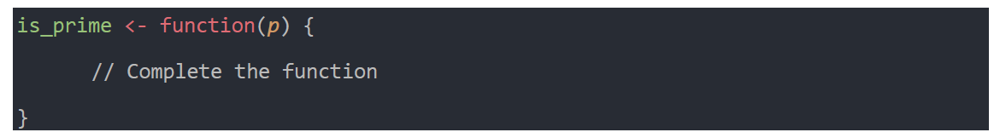
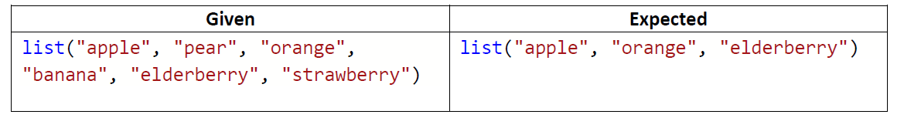

```{r setup, include=FALSE}
knitr::opts_chunk$set(echo = TRUE)
```

## CUNY SPS DS_Challenge_R

###Question 1 

Complete the function below to return TRUE if a number is a prime, otherwise return FALSE: 



```{r}
#creating R function to accept a number and return TRUE if a number is a prime, otherwise return FALSE: 
is_prime <- function(num){
  
  if (num == 2) {
      TRUE
   } else if (any(num %% 2:(num-1) == 0)) {
      FALSE
   } else { 
      TRUE
   }
}
```

```{r}
#Testing is prime function 
test_prime_num <- is_prime(6)
print(test_prime_num)
print(is_prime(5))
```


###Question 2
Given a list of the following words, write code in R to filter the list to fruits that start with a vowel:




```{r message=FALSE, warning=FALSE}
library(tidyverse)
library(stringr)
```

```{r}
#Create a list of fruits as given in the question
fruit_list <- list('apple','pear','orange','banana','elderberry','strawberry')
paste0(fruit_list)
typeof(fruit_list)
```


```{r}
#Using grep function to find the index of fruit in the list starting with vowels
fruits_with_vowel_index <- c(grep("^[aeiouy]", tolower(fruit_list)))
paste0(fruits_with_vowel_index)
typeof(fruits_with_vowel_index)
```

```{r}
#filter the list of fruits using index obtained from above operation
fruits_start_with_vowles <- fruit_list[fruits_with_vowel_index]
paste0(fruits_start_with_vowles)
typeof(fruits_start_with_vowles)

```


